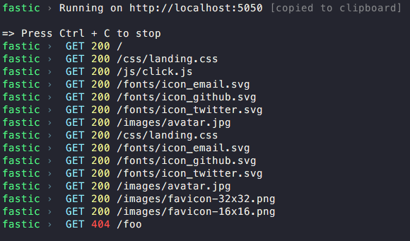

# Fastic 🚀

> Fast & Lightweight HTTP server, that just works. Accessible through CLI.



# Highlights
- Beautiful output
- Zero-config (unless you want to specify a custom port or directory).
- Easy access through CLI.
- Automatically guesses the content type, using file extension.
- Logs HTTP requests, response status codes.

# Install
```bash
npm install --global fastic
```
You can also use `npx`:
```bash
npx fastic
```

# Usage

```bash
Usage
 $ fastic [port] [directory]

Examples
 $ fastic
 $ fastic 8250 ~/DEV/website
```

**port**

Custom port of choice, defaults to `5050`.

**directory**

Directory, from which the server is going to start, default is current path.

## License

MIT
